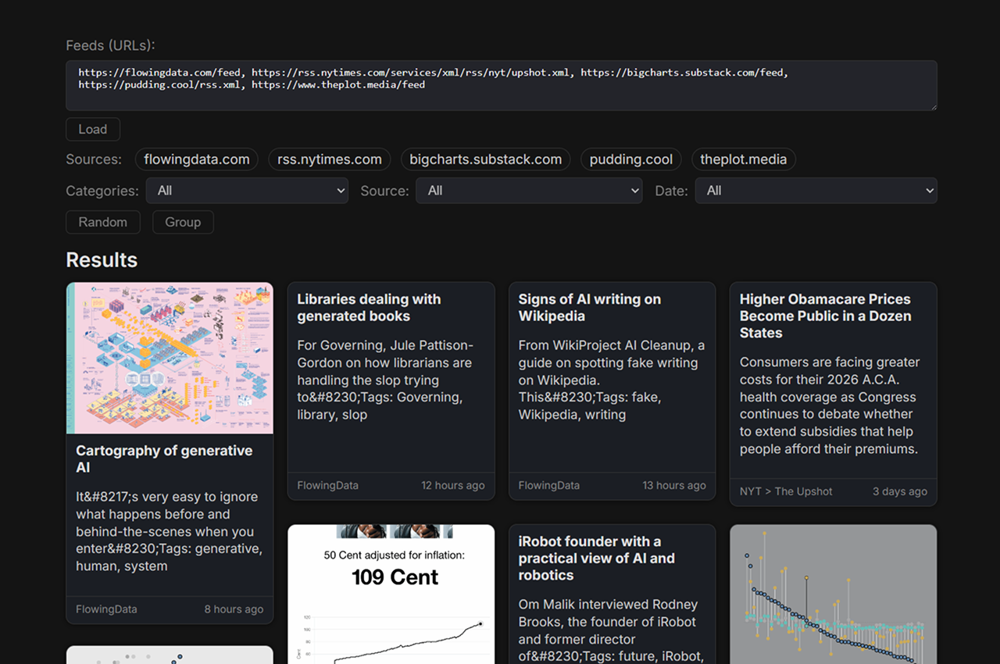

# svelte-rss-feed
A minimalist RSS feed reader built with SvelteKit and TypeScript

⚠️ Building in public: This RSS feed reader is currently in its initial phase, and what is being published is only its first version, far from the desired result.

Demo: https://juanchiparra.github.io/svelte-rss-feed/



## Features
- Add multiple feed links at once
- Works with most RSS feeds
- See recent articles in a clean card layout
- Filter by topic, source, and date
- Search by words to quickly find items
- Responsive design for mobile and desktop

### For future upgrade
- Accessibility improvements (clearer navigation, better keyboard support, and screen‑reader labels)
- Better topics and categories (refine the list and improve how items are classified)


## Project structure
```
svelte-rss-feed/
├── src/
│  ├── lib/
│  │  ├── actions/masonry.ts
│  │  ├── components/
│  │  ├── rss.ts
│  │  ├── styles/global.css
│  │  ├── taxonomy.json
│  │  └── utils/
│  ├── routes/
│  │  ├── +layout.svelte
│  │  ├── +layout.ts
│  │  ├── +page.server.ts
│  │  └── +page.svelte
│  ├── app.html
│  └── app.d.ts
├── static/
├── package.json
├── svelte.config.js
├── tsconfig.json
└── vite.config.ts
```

## Getting started
```bash
# Clone this repository
git clone https://github.com/juanchiparra/svelte-rss-feed.git
cd svelte-rss-feed

# Install the dependencies
npm install

# Start the development server
npm run dev
```

## Commands
- `npm run dev`
- `npm run build`
- `npm run preview`
- `npm run deploy`

## Contributions
Contributions are welcome! If you encounter a problem or have an idea to improve the project, open an issue or send a pull request.
